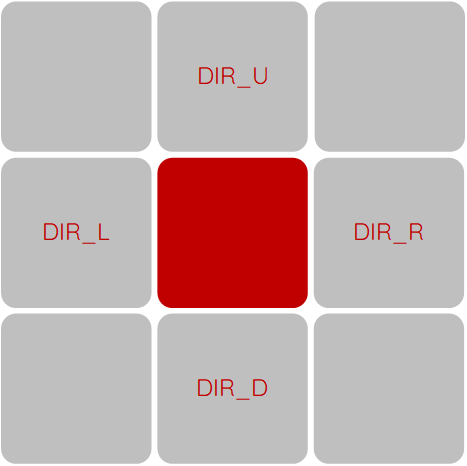

# Sommaire
[TOC]

# Les spécifications
## La grille

La grille, sur laquelle se trouve le labyrinthe, est composée de cellules. Ces cellules peuvent avoir deux états. Soit elles sont un mur, infranchissables, ou alors elles ne sont pas un mur dans quel cas on peut naviguer dessus. 

## Le gène

Un gène est un entier appartenant à l’ensemble suivant :

$ S = {0, 1, 2, 3, 4}$

Cet ensemble représente les possibilités de mouvements sur la grille du labyrinthe. C’est-à-dire que chaque gène est une instruction de mouvement qui formera un décalage de la tête du chemin sur la grille. Ces mouvements sont décrits comme ceci :

```py
DIR_U 	= 0 			        # Up 
DIR_D 	= 1				# Down
DIR_L 	= 2				# Left
DIR_R 	= 3				# Right

OPERATORS = {
 	DIR_U: 	(  0, -1),
        	DIR_D: 	(  0,  1),
        	DIR_L: 	( -1,  0),
        	DIR_R: 	(  1,  0)
    }
```
Lorsqu’on applique une opération (un gène) sur une cellule de la grille, on reçoit la prochaine cellule se trouvant soit en-dessous, au-dessus, à droite ou à gauche de la cellule de départ. Ceci est illustré dans le schéma ci-dessous.



## L’individu (le chromosome)
Un individu est composé d’un ensemble de gènes. Cet ensemble est aussi appelé chromosome, c’est ce qui définit l’individu en soit. Un chromosome a une taille maximale de `CHROMOSOME_LENGTH` définit comme suit :
```py

CHROMOSOME_LENGTH   = (int)((grid.shape[0] * grid.shape[1]) / 2)
```
Ceci est en effet la taille maximale d'un chemin sur la grille.

## Le but
Le but d'un individu est de présenter une solution à la recherche du meilleur chemin pour atteindre la cellule cible en partant de la cellule de départ dans un labyrinthe sur une grille donnée. Il faut alors naviguer sans traverser de mur, sans se bloquer dans une impasse (un "dead-end"). On cherche alors à générer le meilleur individu possible grâce aux éléments ci dessus.

# La démarche
## L'initialisation
Le package "deap" est utilisé tout au long de cette implémentation, pour connaître les spécifications d'utilisation il serait utile de consulter la documentation de ce dernier sous ce [lien](https://deap.readthedocs.io/en/master/overview.html).

## Création d'un chemin depuis un individu
Afin de pouvoir évaluer la capacité de survie ou "fitness" d'un individu, il faut tout d'abord le transformer en un chemin sur la grille. Pour cela, on utilise la fonction `parse_chromosome`. Cette fonction prend la première cellule, la cellule de départ, et y applique les instructions spécifiés par les gènes du chromosome que l'on souhaite transformer en chemin. 

Il faut tout d'abord voir si cette cellule est une impasse, serait-ce le cas, elle peut être marquée comme un mur, afin de ne plus jamais y retourner. Ce n'est vraissemblablement pas la bonne voie.

La fonction `parse_chromosome` se charge notamment de valider une cellule avant de l'ajouter au chemin. Cette étape est cruciale car suivant l'instruction, la prochaine cellule, générée depuis cette instruction, pourrait sortir de la grille ou encore heurter un mur. Deux phénomènes à éviter pour garantir l'intégrité et la validité du chemin.

La validation d'une cellule se fait selon trois conditions élémentaires:
* la cellule doit impérativement être à l'intérieur de la grille ;
* la cellule ne doit pas être un mur ;
* la cellule ne doit pas avoir été visité lors de l'itération précédente.

Cette dernière condition assure que la tête du chemin ne partent pas dans une course frantique en aller-retours sans jamais s'arrêter ou encore en faisant perdre du temps à l'algorithme.

Une fois la cellule validée, elle peut être ajoutée au chemin.

Lorsque la fonction termine la compilation du chemin, elle le retourne.

## Fitness
La fonction de fitness peut alors utiliser le chemin généré auparavant pour en calculer la "survivabilité". Ce n'est rien d'autre qu'un score qui servira de classer l'individu parmi ces congénères. Ce score est évalué selon deux critères:

* L'**indécision** désigne si le chemin contient plusieurs fois la même cellule, il est alors indécis sur où aller et retourne sur ces pas, ce qui n'est pas optimal ;
* Le lieu de la cellule cible, si elle est contenue ;

Ceci est implémenté comme suit :
```text
Si le chemin contient la cellule cible ;
    
    Si le chemin n'est pas indécis, 
        le score sera simplement l'index de la cellule cible dans le chemin ;
    
    Sinon, si le chemin est indécisif, 
        le score sera l'index de la cellule abattu par un multiplicateur 
        relativement sévère afin de décourager l'indécision.

Sinon, 
    le score sera la distance euclidienne de la dernière cellule du chemin 
    jusqu'à la cellule cible afin d'encourager le mouvement général vers la cible.
```

## Génération
Après avoir établi un ranking des meilleurs individus selon leur fitness, on peut débuter avec la phase de croisement. Cette partie se fait avec un croisement en un point. Ceci est la meilleure manière de réussir à générer plusieurs branchements différents pour mieux se rapprocher de la cible. 

Lors de chaque génération une partie des gènes subissent des mutations. D'un ordre de 80%.

Une sélection des meilleurs individus est alors accompli grâce à un tournois en groupes de 3.

Ces fonctions sont définies grâce à deap avec les lignes de code suivantes :

```py
toolbox.register("crossover", tools.cxOnePoint)
toolbox.register("mutate", tools.mutShuffleIndexes, indpb=INDPB)
toolbox.register("select", tools.selTournament, tournsize=TOURN_SIZE)
```

Les constantes utilisées lors des expérimentations sont :

```py
CHROMOSOME_LENGTH   = (int)((grid.shape[0] * grid.shape[1]) / 2)
POPULATION_SIZE     = 50
TOURN_SIZE          = 3
CXPB    = 0.5
MUTPB   = 0.8
INDPB   = 0.1
```


